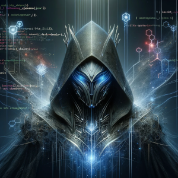

# Darth Agent

[](dart_agent.png)

## Introduction
`darth_agent` is a versatile Dart package designed for seamless integration into Dart or Flutter projects, be it on the backend, web or in mobile applications. This package serves as a foundation for building AI agents, leveraging model interfaces like Ollama and ChatGPT. Developers can customize and extend these agents with specific abilities, personalities, and memory functionalities tailored to their project's needs.

## Features

- **Generic AI Interface**: Easy interaction with AI models like Ollama and ChatGPT. (For now only towards Ollama)
- **Customizable Abilities**: Framework to implement project-specific functions for external data retrieval and processing.
- **Advanced Memory Systems**: Incorporates Retrieval Augmented Generation using ChromaDb for context-rich and intelligent responses.

## Installation
This is not published to pub.dev yet and is far from a working example.

To include `darth_agent` in your project, add the following to your `pubspec.yaml`:

```yaml
dependencies:
  darth_agent: ^latest_version
```